<div align="center">
  <picture>
    
  </picture>
</div>

<div align="center">
  <a href="https://github.com/ManasSoni-2009/PORT-FM">
    
  </a>
  <a href="#-tech-stack">
    
  </a>
</div>

<br />

<div align="center">
  <h3>Welcome to my high-performance, interactive 3D portfolio.</h3>
  <p>
    This site showcases my work as a <b>Full-Stack Developer</b> and <b>AI Agent Specialist</b>, built using cutting-edge web technologies to provide a buttery-smooth, immersive user experience.
  </p>
</div>

<br />

<div align="center">
  <picture>
    
  </picture>
</div>

<table align="center" width="100%">
  <tr>
    <td width="50%" valign="top">
      <h4>🎮 Reactive 3D Avatar</h4>
      <p>A custom-rigged 3D character on the landing page that tracks your mouse movements and reacts to scroll events.</p>
    </td>
    <td width="50%" valign="top">
      <h4>⚛️ Physics-Based Tech Stack</h4>
      <p>An interactive "toy-box" of 3D spheres representing my skillset, powered by <code>@react-three/rapier</code> physics.</p>
    </td>
  </tr>
  <tr>
    <td width="50%" valign="top">
      <h4>📈 GSAP Narrative Scrolling</h4>
      <p>Every section of the site is part of a timed animation sequence that transitions seamlessly as you scroll.</p>
    </td>
    <td width="50%" valign="top">
      <h4>⚡ Performance Optimized</h4>
      <p>Custom-padded SVG textures, simplified 3D geometries, and manual asset chunking ensure a fluid 60FPS experience even on mobile.</p>
    </td>
  </tr>
</table>

<br />

<div align="center">
  <picture>
    
  </picture>
</div>

<table align="center" width="100%">
  <tr>
    <td align="center" width="50%">
      <h3>Frontend & 3D</h3>
      <p>
        
        
        <br/><br/>
        
        
      </p>
    </td>
    <td align="center" width="50%">
      <h3>Animation & Styles</h3>
      <p>
        
        
        <br/><br/>
        
        
      </p>
    </td>
  </tr>
</table>

<br />

<div align="center">
  <picture>
    
  </picture>
</div>

```bash
# 1. Clone the repository
git clone https://github.com/ManasSoni-2009/PORT-FM.git

# 2. Install dependencies
npm install

# 3. Start the local dev server
npm run dev

# 4. Build for Production
npm run build
```

<br />

<div align="center">
  <h3>🤖 AI Porting Support</h3>
  <p>
    This repository includes a special <a href="./AI_PORTING_GUIDE.md"><b>AI_PORTING_GUIDE.md</b></a>. If you are using an AI coding assistant (like Antigravity or Cursor) to help you customize this template, simply point it to that file. It contains exact instructions on which files to edit for a successful migration without breaking the 3D physics or animation timelines.
  </p>
</div>

<br />

<div align="center">
  <picture>
    
  </picture>
</div>

<div align="center">
  <a href="mailto:manassoni009@gmail.com">
    
  </a>
  <a href="https://github.com/ManasSoni-2009">
    
  </a>
  <a href="https://linkedin.com/in/manassoni">
    
  </a>
  <a href="https://www.instagram.com/lumino_ltr/">
    
  </a>
</div>

<br />
<br />

<p align="center">
  Built with ❤️ by <b>Manas Soni</b>
</p>